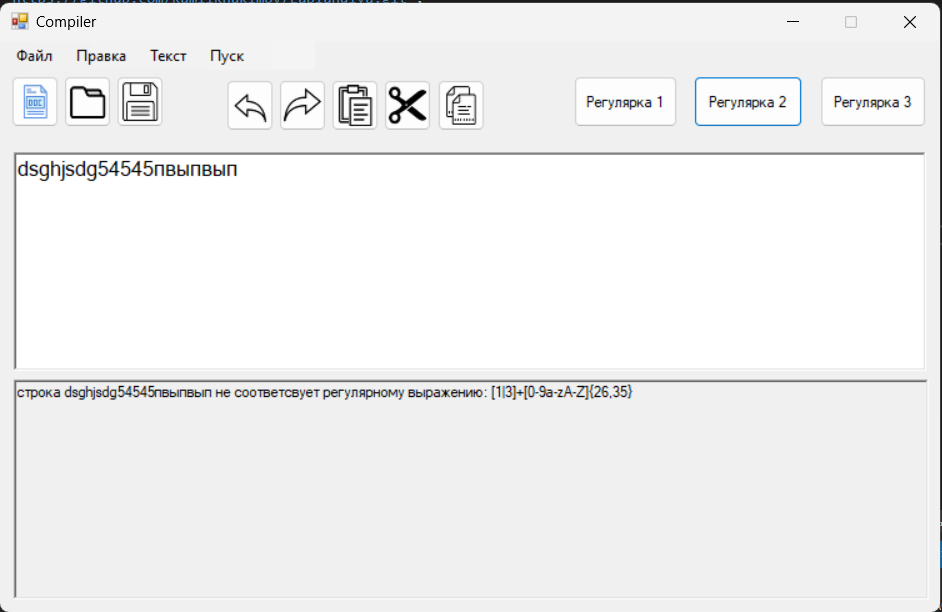

Разработчик Хакимов Камиль, группа АВТ-114
Тема: Разработка лексического анализатора (сканера)
Цель работы: Изучить назначение лексического анализатора. Спроектировать алгоритм и выполнить программную реализацию сканера.

